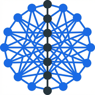

<p align="center">
  
</p>

<h1 align="center">NetStack</h1>

<p align="center">
  Network sizing calculator for Dell Leaf-Spine, Brocade FC SAN, and Converged deployments
</p>

<p align="center">
  <a href="https://github.com/fjacquet/netstack/actions/workflows/ci.yml">
    
  </a>
  <a href="https://github.com/fjacquet/netstack/actions/workflows/deploy.yml">
    
  </a>
  
  
  
  
  
  
  
</p>

<p align="center">
  <a href="https://fjacquet.github.io/netstack/">Live Demo</a> &bull;
  <a href="docs/userguide.md">User Guide</a> &bull;
  <a href="docs/prd.md">PRD</a> &bull;
  <a href="docs/CHANGELOG.md">Changelog</a> &bull;
  <a href="CONTRIBUTING.md">Contributing</a>
</p>

---

## What is NetStack?

NetStack answers one question: **"How many switches and cables do I need to order?"**

Enter your server count and connectivity requirements, and get an instant Bill of Materials for Dell Leaf-Spine (SONiC), Brocade FC SAN, or a combined Converged deployment. No backend, no accounts — everything runs in your browser, even offline.

### Features

- **Three sizing modes** — Spine-Leaf (Ethernet/SONiC), FC SAN (Fibre Channel), and Converged (both combined, in progress)
- **Sizing engine** — Pure-function BOM calculator with Dell and Brocade hardware catalogs
- **Selectable models** — Leaf, Spine, Border Leaf, FC Edge/Director, Rack Size (24U/42U/50U)
- **Switch positioning** — Top-of-Rack (ToR), Middle-of-Rack (MoR), or Bottom-of-Rack (BoR) placement
- **FC SAN** — Dual-fabric design with 9 Brocade switch models (Gen 7 + Gen 8), ISL sizing, and fan-in ratio calculation
- **Topology diagram** — Interactive leaf-spine visualization with @xyflow/react
- **Rack elevation** — Server + Network racks with drag-to-reorder
- **PDF & CSV export** — Full report or raw data for procurement
- **Print** — Ctrl+P with clean light-mode layout, auto-fit to page
- **i18n** — English, French, German, Italian
- **Dark mode** — System preference detection + manual toggle
- **PWA / Offline** — Install as a native app; works without network access

### Supported Hardware

#### Dell Ethernet Switches

| Model | Role | Ports | Power |
|-------|------|-------|-------|
| S5248F-ON | Leaf | 48x25G SFP28 + 4x100G QSFP28 | 647W |
| S5232F-ON | Spine | 32x100G QSFP28 | 635W |
| S5224F-ON | Leaf | 24x25G SFP28 + 4x100G QSFP28 | 455W |
| S5212F-ON | Leaf | 12x25G SFP28 + 3x100G QSFP28 | 304W |
| S3248T-ON | OOB | 48x1G RJ45 + 4x10G SFP+ | 550W |

#### Brocade FC Switches

| Model | Gen | Speed | Ports | Base Ports | POD Unit | Role |
|-------|-----|-------|-------|------------|----------|------|
| G710 | 7 | 64G | 24 | 8 | 8 | Edge |
| G720 | 7 | 64G | 64 | 24 | 8 | Edge |
| G730 | 7 | 64G | 128 | 48 | 8 | Edge |
| X7-4 | 7 | 64G | 256 | 256 | — | Director |
| X7-8 | 7 | 64G | 512 | 512 | — | Director |
| 7850 | 7 | 64G | 24 | 24 | — | Extension |
| G820 | 8 | 128G | 56 | 24 | 8 | Edge |
| X8-4 | 8 | 128G | 192 | 192 | — | Director |
| X8-8 | 8 | 128G | 384 | 384 | — | Director |

## Quick Start

```bash
# Install dependencies
npm install

# Start development server
npm run dev

# Run tests
npm test

# Build for production
npm run build
```

### Offline / Air-Gapped Use

NetStack is a PWA and can be installed from the browser for offline use. For fully air-gapped environments, download the pre-built zip from [GitHub Releases](https://github.com/fjacquet/netstack/releases) and serve it from any static HTTP server.

## Architecture

```
src/
├── domain/           # Pure TypeScript — zero React dependencies
│   ├── catalog/      # Dell + Brocade hardware specs (SWITCH_CATALOG, FC_SWITCH_CATALOG, CABLE_CATALOG)
│   ├── schemas/      # Zod v4 schemas → z.infer<> for all types
│   └── engine/       # calculateBOM(): (SizingInput) => NetworkBOM
├── store/            # Zustand v5 — inputStore (persisted) + resultStore (derived)
├── features/         # React components by feature (form, BOM, topology, rack, export)
├── components/       # Shared UI components (shadcn/ui)
└── i18n/             # Translations (EN, FR, DE, IT)
```

**Import rule:** `Domain → Store → Features` (one-way, never reversed)

## Sizing Formulas

### Spine-Leaf (Ethernet)

| Metric | Formula |
|--------|---------|
| Racks | `ceil(totalServers / serversPerRack)` |
| Leaf switches | `2 × racks` (redundant ToR pair) |
| Spine switches | `max(2, ceil(leafSwitches / 32))` |
| OOB switches | `racks × ceil((serversPerRack + 2) / 48)` |
| Leaf-Spine cables | `leafSwitches × min(spineSwitches, uplinkPorts)` |
| VLT cables | `racks × 2` (QSFP28-DD per leaf pair) |
| SFP28 (fiber) | `2 × serverLeafCables` (LC 25G) |
| QSFP28 (fiber) | `2 × leafSpineCables` (MPO 100G) |

### FC SAN

| Metric | Formula |
|--------|---------|
| Host ports | `totalServers × portsPerServer × fabricCount` |
| Edge switches | Selected model, scaled to cover host ports with POD licensing |
| ISL links | `ceil(hostPorts / fanInRatio)` per fabric (default 7:1) |
| Director switches | Sized by ISL uplink count per fabric |

## Design Decisions

Key architecture decisions are documented as ADRs:

- [ADR-0001](docs/adr/0001-leaf-spine-architecture.md) — Leaf-Spine topology with Dell SONiC
- [ADR-0002](docs/adr/0002-client-side-only.md) — Client-side only (no backend)
- [ADR-0003](docs/adr/0003-zod-schemas-as-source-of-truth.md) — Zod schemas as single source of truth
- [ADR-0004](docs/adr/0004-zustand-state-management.md) — Zustand for state management
- [ADR-0005](docs/adr/0005-xyflow-topology-diagram.md) — @xyflow/react for topology
- [ADR-0006](docs/adr/0006-react-pdf-lazy-loading.md) — Lazy-loaded PDF generation
- [ADR-0007](docs/adr/0007-vlt-cable-modeling.md) — VLT cable and transceiver modeling
- [ADR-0008](docs/adr/0008-i18n-react-i18next.md) — Synchronous i18n with react-i18next
- [ADR-0009](docs/adr/0009-fc-parallel-domain-isolation.md) — Fibre Channel as a parallel domain with no shared state
- [ADR-0010](docs/adr/0010-fc-isl-fan-in-ratio.md) — FC ISL fan-in ratio of 7:1 (Broadcom default)
- [ADR-0011](docs/adr/0011-spine-minimum-two.md) — Spine count minimum of 2 for redundancy
- [ADR-0012](docs/adr/0012-hardware-catalog-extensibility.md) — Extensible hardware catalog with JSON override
- [ADR-0013](docs/adr/0013-switch-positioning-rack-level.md) — Switch positioning is rack-level, not row-level
- [ADR-0014](docs/adr/0014-oob-colocation-with-data-switches.md) — OOB switch co-located with data switches
- [ADR-0015](docs/adr/0015-zustand-persist-versioned-schema.md) — Zustand persist with versioned schema and merge strategy
- [ADR-0016](docs/adr/0016-tdd-red-green-for-domain-functions.md) — TDD (RED-GREEN) for all pure domain functions
- [ADR-0017](docs/adr/0017-pwa-offline-support.md) — PWA with offline support via vite-plugin-pwa

## Tech Stack

| Layer | Technology |
|-------|------------|
| Framework | React 19 + Vite 6 |
| Language | TypeScript (strict, no `any`) |
| Styling | Tailwind CSS v4 |
| State | Zustand v5 with localStorage persistence |
| Validation | Zod v4 |
| Diagrams | @xyflow/react |
| PDF | @react-pdf/renderer |
| PWA | vite-plugin-pwa + Workbox |
| Testing | Vitest + Testing Library |
| Deployment | GitHub Pages via GitHub Actions |

## License

[ISC](LICENSE)
